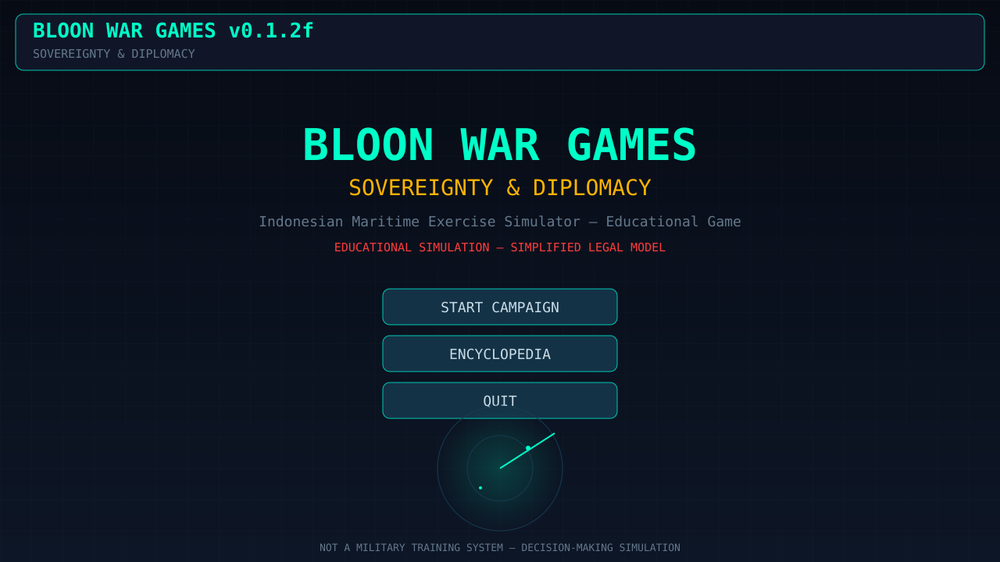
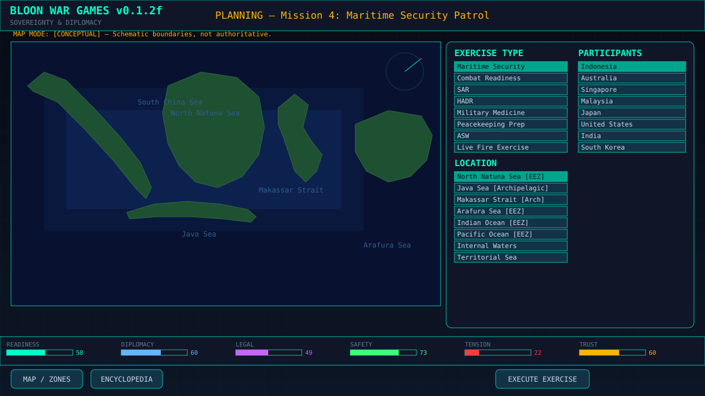
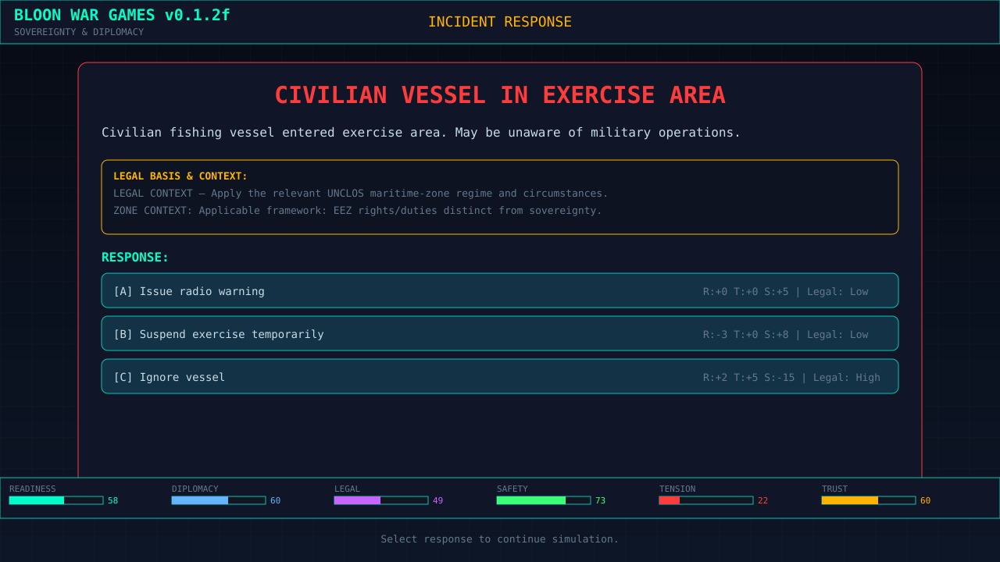
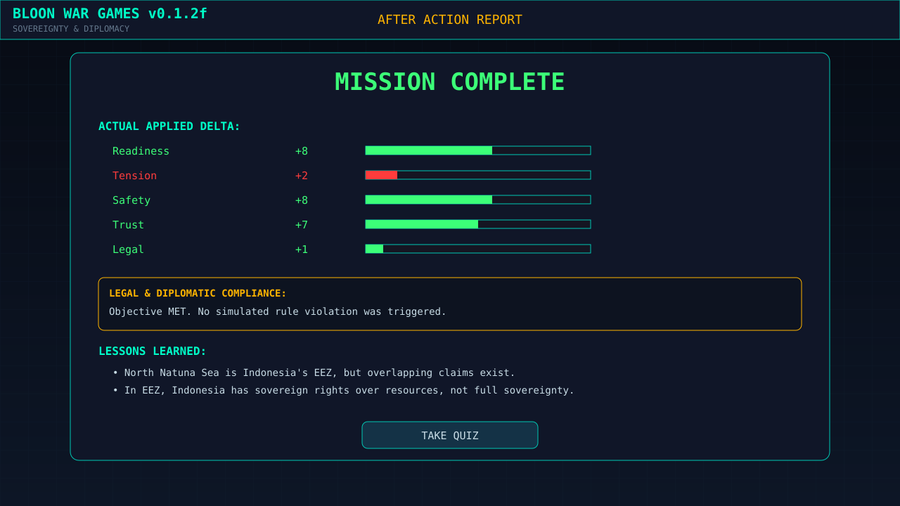

# 🌊 BLOON WAR GAMES: SOVEREIGNTY & DIPLOMACY
### Indonesian Maritime Exercise Simulator — Educational Game

> **MARITIME EXERCISE, SOVEREIGNTY & CRISIS MANAGEMENT SIMULATOR**
A computational simulation of maritime exercises, contested situations,
diplomatic responses, safety constraints, and international legal frameworks.

**BLOON WAR GAMES** adalah simulasi strategi geopolitik dan hukum laut internasional yang bersifat edukatif. Pemain tidak berperan sebagai komandan tempur yang menghancurkan musuh, melainkan sebagai **Strategic Operations Officer** yang merencanakan latihan militer, mengelola diplomasi, dan menangani insiden maritim berdasarkan kerangka hukum **UNCLOS 1982**.

> ⚠️ **DISCLAIMER:** Game ini adalah **SIMULASI EDUKASI** dan model hukum yang disederhanakan. Ini bukan perangkat lunak pelatihan militer sungguhan, bukan nasihat hukum, dan tidak mewakili kebijakan resmi pemerintah mana pun.

---
## 🖥️ Preview

<p align="center">
  
</p>

<p align="center">
  
</p>

<p align="center">
  
</p>

<p align="center">
  
</p>

---

## ✨ Fitur Utama

- **Event-Driven Core & True Accounting:** Sistem pembukuan stat yang akurat. *After Action Report (AAR)* menampilkan *Actual Applied Delta* (memperhitungkan batas minimum/maksimum stat), bukan sekadar angka yang diminta.
- **8 Misi Kampanye:** Mulai dari patroli kedaulatan, latihan SAR bilateral, HADR multilateral ASEAN, hingga penanganan insiden zona abu-abu di ZEE (Zona Ekonomi Eksklusif).
- **Ensiklopedia UNCLOS & Kuis:** Pembelajaran interaktif tentang *Sovereignty* vs *Sovereign Rights*, *Innocent Passage*, dan sengketa hukum laut.
- **Headless Self-Test Engine:** Dilengkapi dengan 16 *production-path tests* yang dapat dijalankan tanpa membuka jendela GUI (`--self-test`).
- **Zero External Assets:** 100% grafis dibuat menggunakan *Pygame primitives* (garis, poligon, rect) dan audio prosedural. Tidak butuh internet atau file aset eksternal.
- **Zone-Aware Legal Context:** Insiden hukum secara dinamis menyesuaikan konteks dasar hukum berdasarkan zona maritim tempat latihan berlangsung.

---

## 🚀 Instalasi & Cara Menjalankan

### Prasyarat
- Python 3.8 atau lebih baru
- Pip (Python package installer)

### Langkah-langkah
1. Clone atau download repository ini.
2. Install dependensi yang dibutuhkan:
   ```bash
   pip install -r requirements.txt